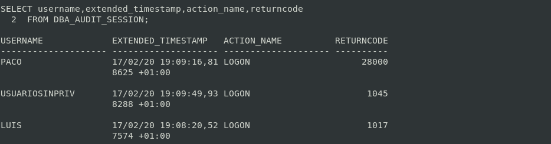
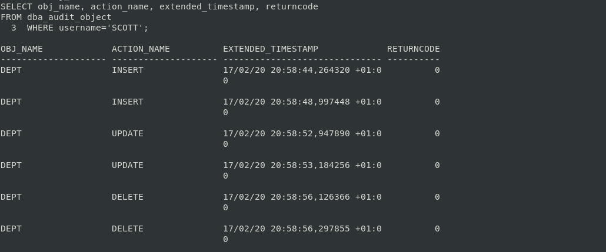
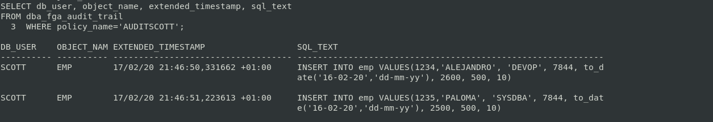
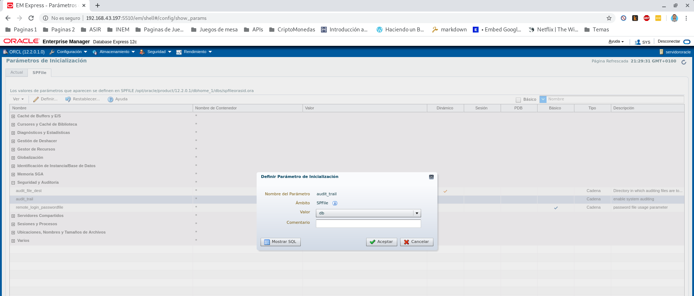
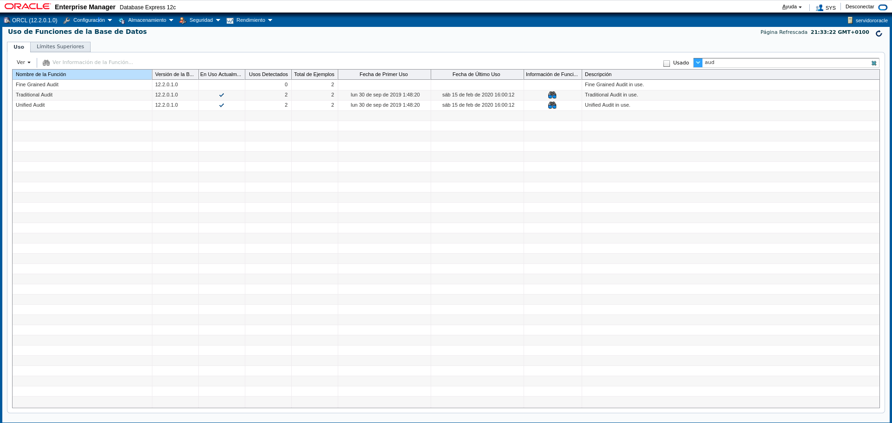

# Auditorías de Bases de Datos

Vamos a realizar un examen de los accesos a los datos almacenados en las bases de datos con el fin de poder medir, monitorear y tener constancia de los accesos a la información almacenada en las mismas.

## Tarea 1

**Activa desde SQL*Plus la auditoría de los intentos de acceso fallidos al sistema. Comprueba su funcionamiento.**

Los parametros de inicialización que influyen en el comportamiento del servidor de Oracle se pueden mostrar con el comando `SHOW PARAMETER AUDIT`.

```sql
SHOW PARAMETER AUDIT

NAME                                  TYPE        VALUE
------------------------------------  ----------- ------------------------------
audit_file_dest                       string      /opt/oracle/admin/orcl/adump
audit_syslog_level                    string
audit_sys_operations                  boolean     TRUE
audit_trail                           string      DB
unified_audit_sga_queue_size          integer     1048576
```

Como podemos ver, el parámetro estático `audit_trail`, tiene el valor de `DB`, lo cual significa que la auditoría esta habilitada, con todos los registros de auditoría almacenados en la prueba de auditoría de la base de datos. Este parametro puede tener varios valores:

|Valor          |Descripción
|:-------------:|:---------------------------
|NONE           |La auditoría esta desactivada.
|DB             |La auditoría esta habilitada, con todos los registros de auditoría almacenados en la prueba de auditoría de la base de datos.
|XML            |La auditoría esta habilitada, con todos los registros de auditoría almacenados como archivos OS de formato XML.
|XML,extended   |Como el valor XML, pero las columnas `SQL_BIND` y `SQL_TEXT` también se rellenan.
|DB, extended   |Como el valor DB, pero las columnas `SQL_BIND` y `SQL_TEXT` también se rellenan.
|OS             |La auditoría está habilitada, con todos los registros de auditoría almacenados en el sistema operativo.

El valor del parámetro `audit_trail` podemos cambiarlo con el comando `ALTER SYSTEM SET audit_trail=<ASIGNAR_VALOR> SCOPE=SPFILE;`. Y luego de esjecitar el comando tendremos que reiniciar la instalancia.

Sabiendo esto, ahora podemos activar la auditoría de los intentos de acceso fallido al sistema. Vamos a ejecutar el comando `AUDIT CREATE SESSION WHENEVER NOT SUCCESSFUL;`.

```sql
AUDIT CREATE SESSION WHENEVER NOT SUCCESSFUL;

    Auditoría terminada correctamente.
```

Si no le indicamos el usuario `AUDIT CREATE SESSION BY <usuario> WHENEVER NOT SUCCESSFUL`, auditará a todos los usuarios menos al usuario **SYS**, además la opción `WHENEVER NOT SUCCESSFUL` es para auditar los accesos fallidos, si no le indicamos si es fallida o exitosa, auditará los dos modos.

Podemos ver si se ha activado la auditoria con la vista `dba_priv_audit_opts`, la cual lista los privilegios actuales del sistema auditados en todo el sistema y por usuario.

```sql
SELECT * FROM dba_priv_audit_opts;

    USER_NAME	     PROXY_NAME 	  PRIVILEGE	       SUCCESS	  FAILURE
    ---------------- ---------------- ---------------- ---------- ----------
                                      CREATE SESSION   NOT SET	  BY ACCESS
```

Como podemos ver, tenenos una auditoría activa, auditando el privilegio `CREATE SESSION`.

Ahora vamos a realizar un test, con 3 pruebas, para comprobar que funciona correctamente la auditoria. La prueba va a consistir en realizar una conexión al usuario Luis pero fallando en la contraseña de acceso, accediendo a Paco con el acceso bloqueado y crearemos un usuario sin el privilegio de `CREATE SESSION`.

**Prueba 1**

Fallamos en la contraseña de acceso de Luis:
```sql
connect LUIS
  Introduzca la contraseña: 
  ERROR:
  ORA-01017: nombre de usuario/contraseña no válidos; conexión denegada
```

**Prueba 2**

Bloqueamos al usuario Paco:
```sql
ALTER USER PACO account lock;
```

Accedemos con el usuario Paco:
```sql
connect PACO
  Introduzca la contraseña: 
  ERROR:
  ORA-28000: la cuenta está bloqueada
```

**Prueba 3**

Creamos el usuario sin el privilegio:
```sql
CREATE USER UsuarioSinPriv IDENTIFIED BY prueba;
```

Accedemos con el usuario UsuarioSinPriv:
```sql
connect USUARIOSINPRIV
  Introduzca la contraseña: 
  ERROR:
  ORA-01045: el usuario USUARIOSINPRIV no tiene privilegio CREATE SESSION;
  conexión denegada
```


**Comprobamos la auditoria**

Utilizaremos la vista `DBA_AUDIT_SESSION` para ver el usuario, la fecha, la acción y el código de error de los fallos de los test de la auditoría.



```sql
SELECT username,extended_timestamp,action_name,returncode
FROM DBA_AUDIT_SESSION;

USERNAME        EXTENDED_TIMESTAMP      ACTION_NAME      RETURNCODE
--------------- ----------------------- ---------------- ----------
PACO            17/02/20 19:09:16,81    LOGON            28000
                8625 +01:00

USUARIOSINPRIV  17/02/20 19:09:49,93    LOGON            1045
                8288 +01:00

LUIS            17/02/20 19:08:20,52    LOGON            1017
                7574 +01:00
```

Como podemos ver, podemos ver los intentos fallidos de Luis,

Si queremos desactivar la auditoría se realiza con la siguiente sentencia.
```sql
NOAUDIT CREATE SESSION WHENEVER NOT SUCCESSFUL;
```

Y si queremos limpiar las tabla de auditoria ejecutamos estos procesos en orden.

```sql
BEGIN
  DBMS_AUDIT_MGMT.INIT_CLEANUP(
  AUDIT_TRAIL_TYPE => DBMS_AUDIT_MGMT.AUDIT_TRAIL_ALL,
  DEFAULT_CLEANUP_INTERVAL => 12 );
END;
/


BEGIN
  DBMS_AUDIT_MGMT.clean_audit_trail(
  audit_trail_type => DBMS_AUDIT_MGMT.AUDIT_TRAIL_ALL,
  use_last_arch_timestamp => false);
END;
/

BEGIN
  DBMS_AUDIT_MGMT.deinit_cleanup(
  audit_trail_type => DBMS_AUDIT_MGMT.AUDIT_TRAIL_ALL);
END;
/
```


## Tarea 2

**Realiza un procedimiento en PL/SQL que te muestre los accesos fallidos junto con el motivo de los mismos, transformando el código de error almacenado en un mensaje de texto comprensible.**

```sql
CREATE OR REPLACE PROCEDURE MostrarErroresAcceso
IS
  cursor c_DatosAuditoria is
  select username,extended_timestamp,returncode
  from dba_audit_session
  where returncode != 0;
  v_Mensaje VARCHAR2(50);
BEGIN
  dbms_output.put_line(RPAD('USUARIO',20)||' '||RPAD('FECHA',25)||' '||RPAD('Mensaje',45));
  dbms_output.put_line(RPAD('-',20,'-')||' '||RPAD('-',25,'-')||' '||RPAD('-',45,'-'));
  for v_Dato in c_DatosAuditoria loop 
    v_Mensaje:=CodigoPorMensaje(v_Dato.returncode);
    dbms_output.put_line(RPAD(v_Dato.username,20)||' '||RPAD(v_Dato.extended_timestamp,25)||' '||RPAD(v_Mensaje,45));
  end loop;
END;
/

CREATE OR REPLACE FUNCTION CodigoPorMensaje(p_Codigo NUMBER)
RETURN VARCHAR2
IS
  v_Mensaje VARCHAR2(50);
BEGIN
  case 
    when p_Codigo=1017 then
      v_Mensaje:='Contraseña erronea';
    when p_Codigo=28000 then
      v_Mensaje:='Usuario bloqueado';
    when p_Codigo=1045 then
      v_Mensaje:='Usuario sin privilegios de sesión';
    else
      v_Mensaje:='Se desconoce el error, avise al Administrador';
  end case;
  return v_Mensaje;
END;
/
```

```sql
exec MostrarErroresAcceso
  USUARIO              FECHA                     Mensaje
  -------------------- ------------------------- ---------------------------------------------
  PACO                 17/02/20 19:09:16,818625  Usuario bloqueado
  USUARIOSINPRIV       17/02/20 19:09:49,938288  Usuario sin privilegios de sesión
  LUIS                 17/02/20 19:08:20,527574  Contraseña erronea
```

## Tarea 3

**Activa la auditoría de las operaciones DML realizadas por SCOTT. Comprueba su funcionamiento.**

Vamos a activar la auditoría de las sentencias DML (Insert, Update, Delete) del esquema Scoott.

```sql
AUDIT INSERT TABLE, UPDATE TABLE, DELETE TABLE BY SCOTT;

  Auditoría terminada correctamente.
```

Ahora vamos a realizar los test para comprobar la auditoría. Nos conectamos al usuario Scott e insertamos, actualizamos y borramos registros.

Insertamos datos:
```sql
INSERT INTO DEPT VALUES(50,'DEVOP','Sevilla');
INSERT INTO DEPT VALUES(60,'DEVELOPED','Huelva');
```

Actualizamos datos
```sql
UPDATE DEPT SET DNAME='INFORMATICA' WHERE DEPTNO=60;
UPDATE DEPT SET LOC='Madrid' WHERE DEPTNO=50;
```

Eliminamos datos
```sql
DELETE FROM DEPT WHERE DEPTNO=50;
DELETE FROM DEPT WHERE DEPTNO=60;
```

Realizamos un commit para guardar las modificaciones:
```sql
COMMIT
```

**Comprobamos la auditoria**



```sql
SELECT obj_name, action_name, extended_timestamp, returncode
FROM dba_audit_object
WHERE username='SCOTT';

  OBJ_NAME ACTION_NAME  EXTENDED_TIMESTAMP               RETURNCODE
  -------- ------------ -------------------------------- ----------
  DEPT     INSERT       17/02/20 20:58:44,264320 +01:00  0
  DEPT     INSERT       17/02/20 20:58:48,997448 +01:00  0
  DEPT     UPDATE       17/02/20 20:58:52,947890 +01:00  0
  DEPT     UPDATE       17/02/20 20:58:53,184256 +01:00  0
  DEPT     DELETE       17/02/20 20:58:56,126366 +01:00  0
  DEPT     DELETE       17/02/20 20:58:56,297855 +01:00  0
```

Si queremos desactivar la auditoría se realiza con la siguiente sentencia.
```sql
NOAUDIT INSERT TABLE, UPDATE TABLE, DELETE TABLE BY SCOTT;
```

## Tarea 4

**Realiza una auditoría de grano fino para almacenar información sobre la inserción de empleados del departamento 10 en la tabla emp de scott.**

Las auditorías de grano fino almacenan más datos sobre las sentencias que ejecutamos, como la estructura completa de la sentencias.

Para realizar esta auditoría hay que activa una política con un procedimiento, indicandole el esquema, el nombre del objeto, la condición por la cual se va a registrar y el tipo de de sentencia.

```sql
BEGIN
    DBMS_FGA.ADD_POLICY (
        object_schema      =>  'SCOTT',
        object_name        =>  'EMP',
        policy_name        =>  'AuditScott',
        audit_condition    =>  'DEPTNO = 10',
        statement_types    =>  'INSERT'
    );
END;
/
```

Podemos ver si la política **AuditScott** se ha activado correctamente con la siguiente SELECT:
```sql
SELECT object_schema, object_name, policy_name, policy_text
FROM dba_audit_policies;

OBJECT_SCHEMA OBJECT_NAME  POLICY_NAME  POLICY_TEXT
------------- ------------ ------------ --------------
SCOTT         EMP          AUDITSCOTT   DEPTNO = 10
```

Vamos a insertar datos en la tabla emp y que sea con el depno igual a 10 para realizar las pruebas de la auditoría.
```sql
INSERT INTO emp VALUES(1234,'ALEJANDRO', 'DEVOP', 7844, to_date('16-02-20','dd-mm-yy'), 2600, 500, 10);
INSERT INTO emp VALUES(1235,'PALOMA', 'SYSDBA', 7844, to_date('16-02-20','dd-mm-yy'), 2500, 500, 10);

COMMIT;
```

**Comprobamos la auditoria**



```sql
SELECT db_user, object_name, extended_timestamp, sql_text
FROM dba_fga_audit_trail
WHERE policy_name='AUDITSCOTT';
 
  DB_USER    OBJECT_NAM EXTENDED_TIMESTAMP                  SQL_TEXT
  ---------- ---------- ---------------------------------   ------------------------------------------------------------
  SCOTT	     EMP        17/02/20 21:46:50,331662 +01:00	    INSERT INTO emp VALUES(1234,'ALEJANDRO', 'DEVOP',   7844, to_date('16-02-20','dd-mm-yy'), 2600, 500, 10)

  SCOTT	     EMP        17/02/20 21:46:51,223613 +01:00	    INSERT INTO emp VALUES(1235,'PALOMA', 'SYSDBA',   7844, to_date('16-02-20','dd-mm-yy'), 2500, 500, 10)
```


Si queremos desactivar la auditoría se realiza con la siguiente sentencia.
```sql
BEGIN
    DBMS_FGA.DROP_POLICY (
        object_schema      =>  'SCOTT',
        object_name        =>  'EMP',
        policy_name        =>  'AuditScott'
    );
END;
/
```

## Tarea 5

**Explica la diferencia entre auditar una operación by access o by session.**

Al activar la auditoría podemos indicar `BY SESSION` o `BY ACCESS`.

```sql
AUDIT INSERT TABLE, UPDATE TABLE, DELETE TABLE BY SCOTT BY < SESSION / ACCESS >;
```

La diferencia fundamental es como la vista del diccionaraio de datos `DBA_AUDIT_TRAIL` registra las acciones que captura.

* **BY ACCESS**: Se almacena un solo registro de todas las acciones de DML por cada sesión
* **BY SESSION**: Se almacena un registro de cada acción

## Tarea 6

**Documenta las diferencias entre los valores db y db, extended del parámetro audit_trail de ORACLE. Demuéstralas poniendo un ejemplo de la información sobre una operación concreta recopilada con cada uno de ellos.**

Los valores **DB** y **DB, extended** son muy parecidos. Los dos valores indican que la auditoría estan habilitadas y los datos de los registros se almacenan en la tabla `SYS.AUD$` pero la diferencia es que en el caso de **DB, extended** se rellenan también las columnas `SQL_BIND` y `SQL_TEXT` de la tabla `SYS.AUD$`.

Miramos que anteriormente configuramos el valor en `DB`.

```sql
SHOW PARAMETER AUDIT_TRAIL

NAME                  TYPE          VALUE
--------------------- ------------- ------
audit_trail           string        DB
```

Vemos que al realizar una consulta a la tabla `SYS.AUD$` no tenemos rellenados los campos `SQLTEXT` ni `SQLBIND`. 
```sql
select RETURNCODE, SQLTEXT, SQLBIND from SYS.AUD$ where USERID='PACO';

  RETURNCODE SQLTEXT              SQLBIND
  ---------- -------------------- --------------------
       28000
```

Modificamos el valor de `audit_trail` a `db,  extended`.
```sql
ALTER SYSTEM SET audit_trail=db,extended SCOPE=SPFILE;
```

Tenemos que reiniciar la base de datos para que actualize la modificación.
~~~
shutdown
startup
~~~

Nos aseguramos que tenemos el valor modificado.
```sql
SHOW PARAMETER AUDIT_TRAIL

NAME               TYPE	           VALUE
------------------ --------------- ------------------------------
audit_trail        string	         DB, EXTENDED
```

## Tarea 7

**Localiza en Enterprise Manager las posibilidades para realizar una auditoría e intenta repetir con dicha herramienta los apartados 1, 3 y 4.**

En el Enterprise Manager 12c podemos modificar el valor del parámatero `audit_trail`.


Además podemos ver las audítorias activas y sus características.


## Tarea 8

**Averigua si en Postgres se pueden realizar los apartados 1, 3 y 4. Si es así, documenta el proceso adecuadamente.**

Postgres por defecto no tiene una herramiento de auditoría y para conseguir realizar algo parecido tenemos que descargarnos la herramienta **Audit trigger 91plus**, que consiste en una serie de scripts y trigger realizando la acciones necesarias para una auditoría.

>**NOTA**: La auditoría de los intentos de acceso fallidos al sistema no es posible realizarlo en PostgreSQL

Nos descargamos la herramienta.
~~~
wget https://raw.githubusercontent.com/2ndQuadrant/audit-trigger/master/audit.sql
~~~

Nos conectamos a la base de datos de moralgdb y activamos la herramienta con `\i` e indicandole la ruta del fichero descargado.

```sql
\i /var/lib/postgresql/audit.sql
  
  CREATE EXTENSION
  CREATE SCHEMA
  REVOKE
  COMMENT
  CREATE TABLE
  REVOKE
  COMMENT
  COMMENT
  COMMENT
  COMMENT
  COMMENT
  COMMENT
  COMMENT
  COMMENT
  COMMENT
  COMMENT
  COMMENT
  COMMENT
  COMMENT
  COMMENT
  COMMENT
  COMMENT
  COMMENT
  COMMENT
  CREATE INDEX
  CREATE INDEX
  CREATE INDEX
  CREATE FUNCTION
  COMMENT
  CREATE FUNCTION
  COMMENT
  CREATE FUNCTION
  CREATE FUNCTION
  COMMENT
  CREATE VIEW
  COMMENT
```

Realizamos una inserción en una tabla, para realizar la prueba.
```sql
insert into conflictos values('11','Guerra Civil Española','Desconocida');
  INSERT 0 1
update conflictos set causa='Racial' where codigo='11';
  UPDATE 1
delete from conflictos where codigo='11';
  DELETE 1
```

Y realizamos un SELECT mostrando los campos como en la auditoría de Oracle de grano fino.

```sql
select session_user_name, action, table_name, action_tstamp_clk, client_query
from audit.logged_actions;

  session_user_name  | action | table_name  |       action_tstamp_clk       |                                  client_query                                   
  -------------------+--------+-------------+-------------------------------+---------------------------------------------------------------------------------
   postgres          | I      | conflictos  | 2020-02-18 17:45:26.769894+00 | insert into conflictos values('11','Guerra Civil Española','Desconocida');
   postgres          | U      | conflictos  | 2020-02-18 17:45:19.868247+00 | update conflictos set causa='Racial' where codigo='11';
   postgres          | D      | conflictos  | 2020-02-18 17:46:15.389203+00 | delete from conflictos where codigo='11';
  (3 rows)
```
## Tarea 9

**Averigua si en MySQL se pueden realizar los apartados 1, 3 y 4. Si es así, documenta el proceso adecuadamente.**

En MariaDB pasa como en postgres, que no hay opción ni herramienta para auditar los accesos fallidos.

Tenemos que activar una opción y ponerlo como valor 1.
```sql
SET SESSION profiling = 1;
```

Con esta opción activada con el comando `SHOW PROFILES;` podemos ver todos los registros almacenados.
```sql
SHOW PROFILES;
+----------+------------+--------------------------------------------------------------------------------------------------------------------------------------------------------------------------------------------------------------------------------------------------------------------------------------------------------------+
| Query_ID | Duration   | Query                                                                                                                                                                                                                                                                                                        |
+----------+------------+--------------------------------------------------------------------------------------------------------------------------------------------------------------------------------------------------------------------------------------------------------------------------------------------------------------+
|        5 | 0.00027873 | SELECT DATABASE()                                                                                                                                                                                                                                                                                            |
|        6 | 0.00034870 | SELECT DATABASE()                                                                                                                                                                                                                                                                                            |
|        7 | 0.00104316 | show databases                                                                                                                                                                                                                                                                                               |
|        8 | 0.00045399 | show tables                                                                                                                                                                                                                                                                                                  |
|        9 | 0.01723065 | CREATE TABLE conflictos (
                            codigo                  VARCHAR(3),
                            nombre                  VARCHAR(50),
                            causa                   VARCHAR(15),
                            CONSTRAINT pk_codigo_conflictos PRIMARY KEY(codigo),
                            CONSTRAINT causa_seleccion CHECK(upper(causa) in ('RACIAL','ECONOMICO','RELIGIOSO','DESCONO' |
|       10 | 0.00113668 | INSERT INTO conflictos VALUES ('1','La guerra de Afganistan','Racial')                                                                                                                                                                                                                                       |
|       11 | 0.00309517 | INSERT INTO conflictos VALUES ('2','Campaña Nacional','Economico')                                                                                                                                                                                                                                           |
|       12 | 0.00085026 | INSERT INTO conflictos VALUES ('3','La guerra civil de Sudan del Sur','Religioso')                                                                                                                                                                                                                           |
|       13 | 0.00207190 | INSERT INTO conflictos VALUES ('4','La guerra civil de Myanmar','Religioso')                                                                                                                                                                                                                                 |
|       14 | 0.00745298 | INSERT INTO conflictos VALUES ('5','La guerra de Biafra','Economico')                                                                                                                                                                                                                                        |
|       15 | 0.01295200 | INSERT INTO conflictos VALUES ('6','Segunda guerra del Golfo','Religioso')                                                                                                                                                                                                                                   |
|       16 | 0.00170136 | INSERT INTO conflictos VALUES ('7','Guerra civil de Siria','Racial')                                                                                                                                                                                                                                         |
|       17 | 0.00165590 | INSERT INTO conflictos VALUES ('8','La guerra civil de Yemen','Desconocida')                                                                                                                                                                                                                                 |
|       18 | 0.00094052 | INSERT INTO conflictos VALUES ('9','La guerra civil somali','Economico')                                                                                                                                                                                                                                     |
|       19 | 0.00297236 | INSERT INTO conflictos VALUES ('10','Conflicto del Delta del Niger','Economico')                                                                                                                                                                                                                             |
+----------+------------+--------------------------------------------------------------------------------------------------------------------------------------------------------------------------------------------------------------------------------------------------------------------------------------------------------------+
15 rows in set (0.000 sec)
```

Te muestra una auditoría de grano fino directamente.

## Tarea 10

**Averigua las posibilidades que ofrece MongoDB para auditar los cambios que va sufriendo un documento.**


## Tarea 11

**Averigua si en MongoDB se pueden auditar los accesos al sistema.**

Para realizar auditorías en MongoDB necesitamos una herramiento externa llamada `Mongoaudit`, la cual permite realizar auditorías de seguridad sobre las bases de datos.

Tenemos que instalar la herramienta. La forma más fácil es instalar `python` y `pip` e instalar la herramiento con `pip`.
~~~
pip install mongoaudit
~~~
