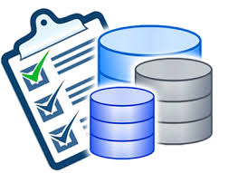

# Auditorías de Bases de Datos

Vamos a realizar un examen de los accesos a los datos almacenados en las bases de datos con el fin de poder medir, monitorear y tener constancia de los accesos a la información almacenada en las mismas.

* [Tarea 1](https://github.com/MoralG/Auditorias_de_Bases_de_Datos/blob/master/Auditorias_de_Bases_de_Datos.md#tarea-1)
Activa desde SQL*Plus la auditoría de los intentos de acceso fallidos al sistema. Comprueba su funcionamiento. 

* [Tarea 2](https://github.com/MoralG/Auditorias_de_Bases_de_Datos/blob/master/Auditorias_de_Bases_de_Datos.md#tarea-2)
Realiza un procedimiento en PL/SQL que te muestre los accesos fallidos junto con el motivo de los mismos, transformando el código de error almacenado en un mensaje de texto comprensible.

* [Tarea 3](https://github.com/MoralG/Auditorias_de_Bases_de_Datos/blob/master/Auditorias_de_Bases_de_Datos.md#tarea-3)
Activa la auditoría de las operaciones DML realizadas por SCOTT. Comprueba su funcionamiento.

* [Tarea 4](https://github.com/MoralG/Auditorias_de_Bases_de_Datos/blob/master/Auditorias_de_Bases_de_Datos.md#tarea-4)
Realiza una auditoría de grano fino para almacenar información sobre la inserción de empleados del departamento 10 en la tabla emp de scott.

* [Tarea 5](https://github.com/MoralG/Auditorias_de_Bases_de_Datos/blob/master/Auditorias_de_Bases_de_Datos.md#tarea-5)
Explica la diferencia entre auditar una operación by access o by session.

* [Tarea 6](https://github.com/MoralG/Auditorias_de_Bases_de_Datos/blob/master/Auditorias_de_Bases_de_Datos.md#tarea-6)
Documenta las diferencias entre los valores db y db, extended del parámetro audit_trail de ORACLE. Demuéstralas poniendo un ejemplo de la información sobre una operación concreta recopilada con cada uno de ellos.

* [Tarea 7](https://github.com/MoralG/Auditorias_de_Bases_de_Datos/blob/master/Auditorias_de_Bases_de_Datos.md#tarea-7)
Localiza en Enterprise Manager las posibilidades para realizar una auditoría e intenta repetir con dicha herramienta los apartados 1, 3 y 4.

* [Tarea 8](https://github.com/MoralG/Auditorias_de_Bases_de_Datos/blob/master/Auditorias_de_Bases_de_Datos.md#tarea-8)
Averigua si en Postgres se pueden realizar los apartados 1, 3 y 4. Si es así, documenta el proceso adecuadamente.

* [Tarea 9](https://github.com/MoralG/Auditorias_de_Bases_de_Datos/blob/master/Auditorias_de_Bases_de_Datos.md#tarea-9)
Averigua si en MySQL se pueden realizar los apartados 1, 3 y 4. Si es así, documenta el proceso adecuadamente.

* [Tarea 10](https://github.com/MoralG/Auditorias_de_Bases_de_Datos/blob/master/Auditorias_de_Bases_de_Datos.md#tarea-10)
Averigua las posibilidades que ofrece MongoDB para auditar los cambios que va sufriendo un documento.

* [Tarea 11](https://github.com/MoralG/Auditorias_de_Bases_de_Datos/blob/master/Auditorias_de_Bases_de_Datos.md#tarea-11)
Averigua si en MongoDB se pueden auditar los accesos al sistema.
